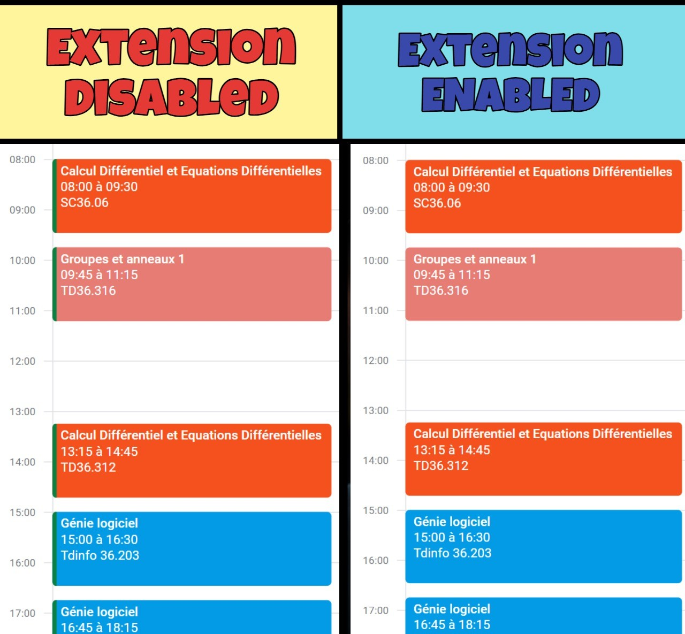
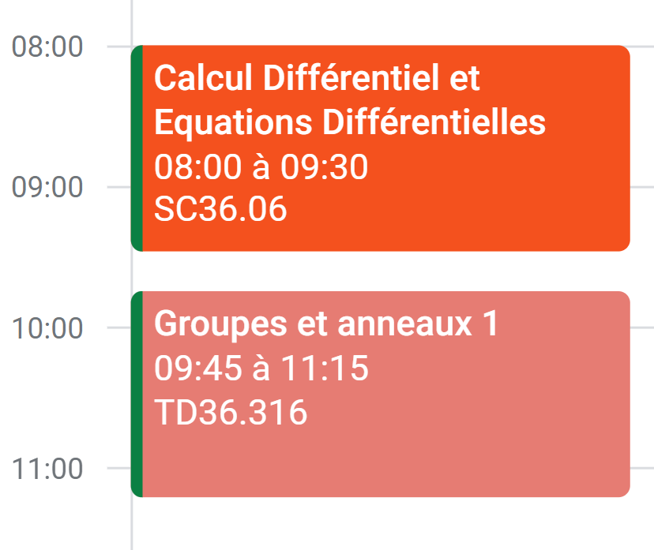

### Introduction

On Google Calendar (Web), when you have multiple calendars enabled, and some events are colored differently from their default, a colored border appears on the left side of those events. This border matches the color of the calendar the event belongs to.



But let's face it, those borders aren’t pretty. That's why I created this Chrome extension to automatically remove them for a cleaner look.

### Installation Instructions

1. **Download the Repository:**

   - Click on the `<> Code` button at the top of this page and select "Download ZIP".
   - Extract the downloaded ZIP file to a convenient location on your computer.

2. **Open Chrome Extensions Page:**

   - Open Chrome and navigate to `chrome://extensions/`.

3. **Enable Developer Mode:**

   - Toggle the switch for Developer mode in the top right corner.

4. **Load the Extension:**

   - Click on the "Load unpacked" button.
   - Select the directory where you extracted the ZIP file.

5. **Verify Installation:**
   - Once the extension is loaded, go to Google Calendar and check if the borders are removed from the events.

That's it! Your Google Calendar should now have a cleaner look without the colored borders on the left side of events.

### How does it work ?

The HTML code of the borders looks like this :

```html
<div
  aria-hidden="true"
  class="jSrjCf"
  style="background-color: rgb(11, 128, 67);"
></div>
```

This extension finds them and remove them automatically.
